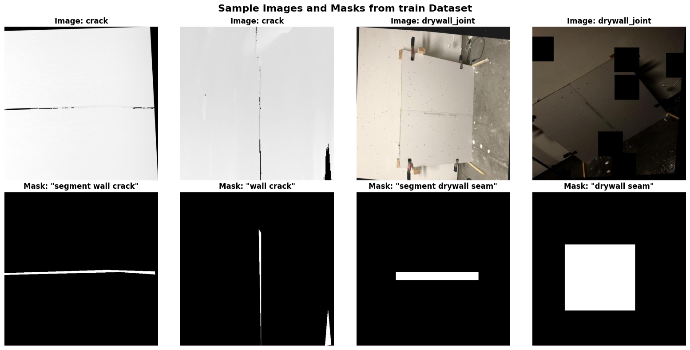
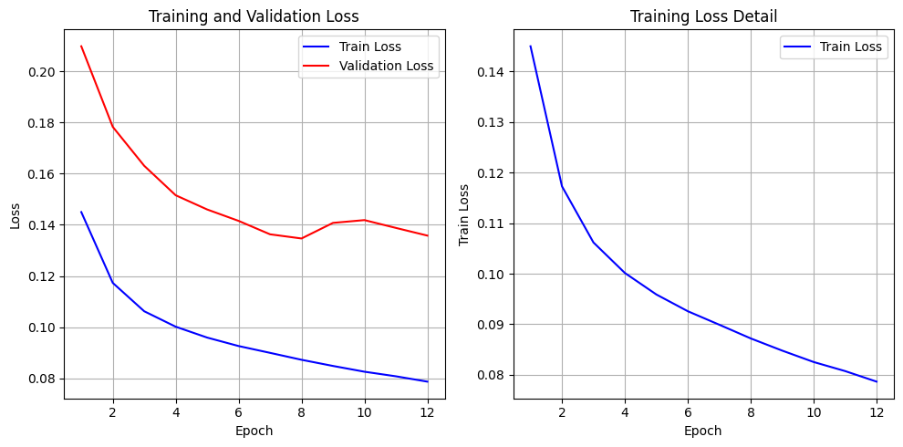
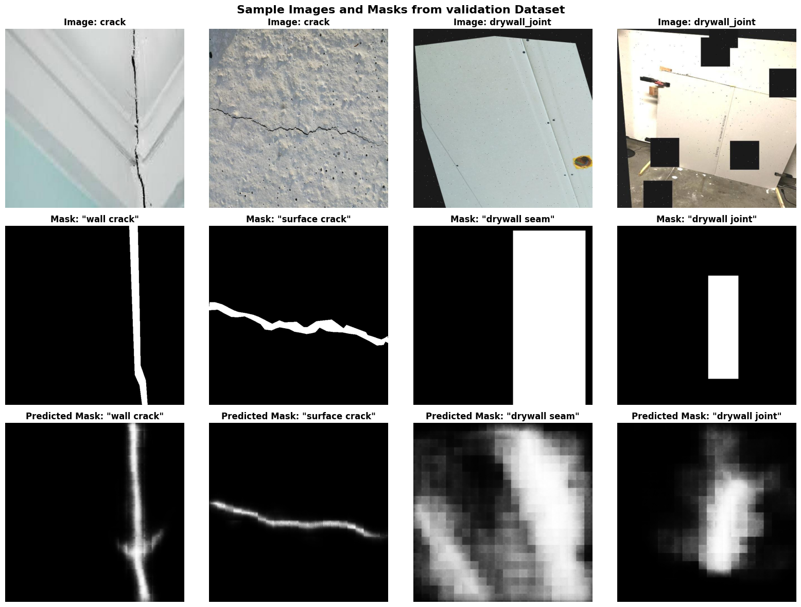

# Prompted Segmentation for Drywall QA: Report

## Problem Statement:
Given an image of a crack or drywall seam/joint, identify and segment the particular section of the image.

## Approach:
I first investigated the possibility of a solution by taking a sample of images from the datasets and prompted ChatGPT (GPT-5) and Gemini (Gemini 2.5-flash) to identify the crack/seam. I was satisfied with the responses which gave me confidence to further investigate building a text-conditioned segmentation model for two specific tasks: segmenting cracks and segmenting taping areas in drywall images that works for us.

CLIPSeg is the most suitable model for this task because it natively supports text-conditioned segmentation [2][3]. It combines a frozen CLIP encoder with a lightweight decoder that can generate binary segmentation masks from text prompts.

The key advantages of this approach are that it is lightweight: Only 1.1M trainable parameters in the decoder and 150.7M parameters in total. It natively supports binary outputs: it is easy to produce PNG masks with values {0,255} as required. Pre-trained: Available on Hugging Face with strong baselines.[2][5]

### About CLIPSeg model:

### about CLIP model and pretraining

#### Architecture and main components:

#### Encoder:

#### Decoder

### Data

I downloaded the dataset from roboflow in the Pascal VOC format, which provides images and annotations in XML format, which can be then parsed via python utility functions

DATASET STATISTICS
==================================================

Cracks Dataset:
  Train: 5164 images, 5164 annotations
  Test: 4 images, 4 annotations
  Valid: 201 images, 201 annotations

Drywall Joints Dataset:
  Train: 820 images, 820 annotations
  Valid: 202 images, 202 annotations

TOTAL SAMPLES:
  Cracks: 5369 images
  Drywall Joints: 1022 images
  Combined: 6391 images

Dataset loading functions defined!
Imports successful!
Loading crack detection dataset...
Loading drywall joint detection dataset...

DATASET STATISTICS
==================================================

Cracks Dataset:
  Train: 5164 images, 5164 annotations
  Test: 4 images, 4 annotations
  Valid: 201 images, 201 annotations

Drywall Joints Dataset:
  Train: 820 images, 820 annotations
  Valid: 202 images, 202 annotations

TOTAL SAMPLES:
  Cracks: 5369 images
  Drywall Joints: 1022 images
  Combined: 6391 images

EXAMINING SAMPLE ANNOTATIONS
==================================================

Sample Crack Annotation:
File: 00002_jpg.rf.0091d2541bc223a680ba21f7e98ef810.jpg
Image size: 640x640x3
Number of objects: 1
  Object 1:
    Class: NewCracks - v2 2024-05-18 10-54pm
    Bounding box: (29, 300) to (641, 530)
    Polygon points: 30 points
    First 3 points: [(504.375, 340.0), (544.375, 321.25), (594.375, 318.75)]

Sample Drywall Joint Annotation:
File: 2000x1500_0_resized_jpg.rf.0240db143fd724683ce9b3dd3114d20b.jpg
Image size: 640x640x3
Number of objects: 1
  Object 1:
    Class: drywall-join
    Bounding box: (253, 1) to (389, 638)

I then created a dataset object which contains both crack and drywall images for both test and validation sets

Creating combined dataset...
Combined datasets created!
   Total train samples: 5984
   Total validation samples: 403

DATASET COMPOSITION:
==============================
Crack samples: 5164 (86.3%)
Drywall joint samples: 820 (13.7%)
Validation Crack samples: 201 (49.9%)
Validation Drywall joint samples: 202 (50.1%)

Sample images from the test dataset:

As you can see from the image and description above, cracks are annotated as polygon points and drywall seams are annotated as bounding boxes. So ideally our trained model should output polygon segment mask for "crack" text inputs and bounding box segment mask for "drywall seam" texts.

The prompts used for text inputs are as below
Text Prompts Distribution:
  'segment crack': 761 samples (12.7%)
  'surface crack': 752 samples (12.6%)
  'crack': 744 samples (12.4%)
  'concrete crack': 741 samples (12.4%)
  'structural crack': 735 samples (12.3%)
  'segment wall crack': 722 samples (12.1%)
  'wall crack': 709 samples (11.8%)
  'wall joint': 112 samples (1.9%)
  'taping area': 103 samples (1.7%)
  'joint tape': 99 samples (1.7%)
  'wall joint line': 99 samples (1.7%)
  'drywall joint': 87 samples (1.5%)
  'segment joint/tape': 84 samples (1.4%)
  'segment taping area': 83 samples (1.4%)
  'segment drywall seam': 81 samples (1.4%)
  'drywall seam': 72 samples (1.2%)

Mask Coverage Analysis:
  Crack mask coverage: 4.87% ± 4.88%
    Range: 0.19% - 28.89%
  Drywall mask coverage: 16.56% ± 13.84%
    Range: 1.45% - 57.62%

DATASET READY FOR CLIPSEG TRAINING!
==================================================
Total train samples: 5,984
Text prompts: 16 unique prompts
Image format: 640x640x3 (RGB)
Mask format: 640x640 (binary)
Categories: 2 (cracks + drywall joints)
Data balance: 5,164 cracks (86.3%) + 820 joints (13.7%)

Ready for CLIPSeg fine-tuning with text prompts!
   Next steps: Load CLIPSeg model and implement training loop

While it is noted that the dataset is biased towards crack images, I decided to investigate the robustness of vision transformers for this task first. I can resort to data augmentation techniques to balance the dataset if required.

### Experimental Setup

I'm using an M4 Pro Macbook Pro with 36 GB of ram (add cpu and gpu specs)

### Training Methodology

First, I tried to freeze the CLIP encoder and fully train the decoder part only. the idea is that the robust pretraining of the encoder will be able to generalize on our dataset images to help identiy cracks and seams

Model loaded and moved to: cpu
Trainable parameters: 1,127,009 / 150,747,746 (0.7%)
Training configuration:
   - Frozen: CLIP encoder
   - Trainable: Decoder only
   - Image size: 640x640
   - Device: cpu
Training Details:
   Optimizer: AdamW (lr=0.0001) Weight decay: 0.0001
   Loss function: BCEWithLogitsLoss
   Device: cpu
   Model input: 640x640 -> 352x352 (internal)
   Model output: 352x352 -> 640x640 (upsampled)
   Trainable parameters: 1,127,009

TRAINING CONFIGURATION
==============================
Batch size: 16
Learning rate: 0.0001
Number of epochs: 8
Save frequency: Every 500 steps
✅ Data loaders created:
   Train batches: 374
   Validation batches: 26
   Samples per epoch: 5984

Input shapes:
  Input IDs: torch.Size([16, 5])
  Attention mask: torch.Size([16, 5])
  Pixel values: torch.Size([16, 3, 352, 352])
  Labels: torch.Size([16, 640, 640])

Model outputs:
  Logits shape: torch.Size([16, 352, 352])
  Labels shape: torch.Size([16, 640, 640])

CLIPSeg behavior:
  Input image: 640x640
  Model processes at: torch.Size([352, 352])
  Needs upsampling to: torch.Size([640, 640])

The performance of the model wasn't that great, the model was basically acting as an edge detector, that can be explained by our dataset's imbalance towards crack images, which have polygon segment annotation. My expectation is that due to text conditioning, the output of drywall seams should be a bounding box. While this scenario suggests my model may be overfitting to the crack image data.

The CLIPSeg model, which is a vision-language model for segmentation, is essentially a combination of a frozen CLIP encoder and a trainable segmentation decoder (often a simple transformer or CNN-based decoder).

Therefore, the regularization techniques you use will primarily focus on controlling the complexity of the trainable components (the decoder) or the training process itself.

So I investigated unfreezing some layers of the CLIP Encoder and later ended up unfreezing all the layers:

Implementation: 1. using $\text{AdamW}$ optimizer, the "W" stands for Weight Decay and it handles this automatically.
2. Setting different learning rates for different parts of a model is a common practice in deep learning, especially when fine-tuning pre-trained models like CLIPSeg (where the encoder is pre-trained and the decoder is newly added or less pre-trained). This technique is called discriminative learning rates or layer-wise learning rates.

Model Component,Recommended Learning Rate,Rationale
Encoder (CLIP Backbone),Lower (≈10−6),"It is heavily pre-trained and only needs minor adjustments to adapt to the new task/data domain. A large LR risks ""catastrophic forgetting."""
Decoder (Segmentation Head),Higher (≈10−4),It is often initialized randomly or with less useful pre-training. It needs to rapidly learn the new task (segmentation) from scratch.

Training Details:
   Optimizer: AdamW (encoder lr=1e-06, decoder lr=0.001)
   Loss function: BCEWithLogitsLoss
   Device: cpu
   Model input: 640x640 -> 352x352 (internal)
   Model output: 352x352 -> 640x640 (upsampled)
   Trainable parameters: 150,747,746

Epoch 1/12
------------------------------
Epoch 1:   0%|          | 0/374 [00:00<?, ?it/s]
/Users/prashanthreddyduggirala/10x/.venv/lib/python3.11/site-packages/transformers/image_processing_utils.py:51: UserWarning: The following named arguments are not valid for `ViTImageProcessor.preprocess` and were ignored: 'padding'
  return self.preprocess(images, **kwargs)
                                                                                        
Epoch 1 completed in 801.3s
   Train Loss: 0.1450
   Val Loss: 0.2099
New best validation loss: 0.2099
Model saved as 'best_clipseg_drywall_model.pth'

Epoch 2/12
------------------------------
                                                                                        
Epoch 2 completed in 796.4s
   Train Loss: 0.1173
   Val Loss: 0.1783
New best validation loss: 0.1783
Model saved as 'best_clipseg_drywall_model.pth'

Epoch 3/12
------------------------------
                                                                                        
Epoch 3 completed in 801.8s
   Train Loss: 0.1062
   Val Loss: 0.1631
New best validation loss: 0.1631
Model saved as 'best_clipseg_drywall_model.pth'

Epoch 4/12
------------------------------
                                                                                        
Epoch 4 completed in 787.2s
   Train Loss: 0.1002
   Val Loss: 0.1516
New best validation loss: 0.1516
Model saved as 'best_clipseg_drywall_model.pth'

Epoch 5/12
------------------------------
                                                                                        
Epoch 5 completed in 786.5s
   Train Loss: 0.0959
   Val Loss: 0.1460
New best validation loss: 0.1460
Model saved as 'best_clipseg_drywall_model.pth'

Epoch 6/12
------------------------------
                                                                                        
Epoch 6 completed in 775.4s
   Train Loss: 0.0926
   Val Loss: 0.1416
New best validation loss: 0.1416
Model saved as 'best_clipseg_drywall_model.pth'

Epoch 7/12
------------------------------
                                                                                        
Epoch 7 completed in 786.9s
   Train Loss: 0.0899
   Val Loss: 0.1363
New best validation loss: 0.1363
Model saved as 'best_clipseg_drywall_model.pth'

Epoch 8/12
------------------------------
                                                                                        
Epoch 8 completed in 787.8s
   Train Loss: 0.0872
   Val Loss: 0.1347
New best validation loss: 0.1347
Model saved as 'best_clipseg_drywall_model.pth'

Epoch 9/12
------------------------------
                                                                                        
Epoch 9 completed in 786.6s
   Train Loss: 0.0848
   Val Loss: 0.1408

Epoch 10/12
------------------------------
                                                                                         
Epoch 10 completed in 784.2s
   Train Loss: 0.0825
   Val Loss: 0.1419

Epoch 11/12
------------------------------
                                                                                         
Epoch 11 completed in 781.0s
   Train Loss: 0.0807
   Val Loss: 0.1388

Epoch 12/12
------------------------------
                                                                                         
Epoch 12 completed in 790.9s
   Train Loss: 0.0787
   Val Loss: 0.1358

TRAINING COMPLETED!
==================================================
Total training time: 9470.3s (157.8 minutes)
Best validation loss: 0.1347
Final train loss: 0.0787
Final validation loss: 0.1358

### Training Footprint

Total parameters: 150,747,746
Trainable parameters: 150,747,746
Training time: 
Memory usage during training: 1.59 GB
Model file size on disk: 583.88 MB
Average inference time per image: 241.04 ms

### Conclusion:
